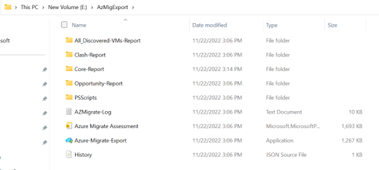

# Azure Migrate Export Utility

## What is Azure Migrate Export?
Azure Migrate Export is a utility package that uses Azure Migrate discovery and assessment information from an already deployed Azure Migrate project to generate a cohesive presentation for executives.

The utility offers users the ability to customize discovered data, assessment output as well as the visualization layer of the presentation by leveraging Microsoft’s own tools such as Excel, Power BI, and PowerPoint/PDF on Edge that would help accommodate desired customizations.

Azure Migrate Export (AME) is a centralized and scalable solution that provides a uniform estimate of cost to drive the customer’s commitment for migration to Azure. 

## How to get Azure Migrate Export Utility Package?
Users can download the Azure Migrate Export utility from https://aka.ms/azuremigrateexport.

The link downloads a .zip file. Extract the contents of the package.

The Package consists of three files:
- Azure-Migrate-Export.exe is a light-weight console app that facilitates running of discovery and assessment and helps fetch data from Azure Migrate discovery and assessment APIs.
- The PSScripts folder consists of underlying PowerShell modules.
- The PowerBI template helps build a cohesive presentation on top of discovery and assessment reports generated after running Azure-Migrate-Export.exe.
The Azure Migrate Export Utility is hosted on an open source github repository. Users can access all versions of this utility package from https://aka.ms/azuremigrateexportutility. Users can use the script to build on top of current solutions.

## How does Azure Migrate Export Work?
The discovery module of the utility package runs to pull discovered data from an already deployed Azure Migrate Project using Azure Migrate APIs. Users can then customize the discovery output for assessment. [Learn More](#how-to-customize-discovery-report) about customization on discovery file.

The assessment module of utility package uses Azure Migrate assessment APIs to run PaaS preferred assessments for in scope machines. Machines that cannot be migrated to PaaS target are assessed for IaaS targets. [Learn More](#azure-migrate-export-assessment-report-generation-logic) about AME assessment logic. The assessment module generates Assessment Core Report, Assessment Opportunity report and Clash Report. 

Users can customize the generated Assessment Core report by referring to the details in the Clash report to get rid of duplicates. This helps the user to generate presentation and cost estimates of only the required target assessments. [Learn More](#how-to-customize-assessment-core-report) about how to customize Assessment report.

The PowerBI template uses the generated discovery and assessment reports to generate the required business presentation which can be downloaded as PPT.

## Prerequisites for running Azure Migrate Export
### User Permissions 
The user logged into the machine should have the permissions and access to run EXE files. 
### Operating System 
The machine should be a 64-bit Windows machine running Windows OS 10 or later. 
### Install Location 
We recommend to download the utility in C: drive. Information is exchanged with APIs in the form of packets, and hence the install location should not have packet inspection / modification rights.
### .NET Framework Version 
The machine running Azure Migrate Export must run on .NET framework 4.7.2 or later. [Learn More](https://learn.microsoft.com/en-us/dotnet/framework/migration-guide/how-to-determine-which-versions-are-installed) on how to check the .NET version running on the machine.
### Transport Layer Security (TLS) 
The operating system must support TLS 1.2. [Learn More](https://learn.microsoft.com/en-us/windows-server/security/tls/tls-registry-settings?tabs=diffie-hellman) on how to check supported TLS version on the machine.
### Memory 
The machine running AME should have at least 8 GB of RAM. 
### Storage 
The machine running AME should have a minimum of 1 GB of free storage in the drive in which the utility package is extracted and stored. 
### Internet 
The machine needs persistent internet access, throughout the process.
### Port Access 
The machine should have TCP port 443 open with traffic direction as Outbound External and Outbound Internal, as multiple HTTPS API calls will be made to send and receive data. 
### PowerShell Version 
The machine running AME should have to have PowerShell version 5.1 or higher installed.
### Execution Policy 

> [!Note]
> The Azure Migrate Export utility configures required execution policy automatically, but we strongly recommend that users set the required execution policy before running the utility.

The execution policy in PowerShell should be set to RemoteSigned, for the CurrentUser and LocalMachine. This can be achieved by following the steps below: 
1. Open PowerShell as an administrator. 
2. Run the following commands: 
   - Set-ExecutionPolicy -Scope CurrentUser RemoteSigned 
   - Set-ExecutionPolicy -Scope LocalMachine RemoteSigned 
3. To view the Execution Policies, run the Get-ExecutionPolicy -List command.

   
  
### PowerShell Modules 
> [!Note] 
> The Azure Migrate Export utility installs modules if they are not present, but we strongly recommend having the modules pre-installed. 
> If you are installing these modules for the first time, respond [Y] for yes and [A] for ‘Yes to All” to install the required modules. 

The following modules are needed to run Azure Migrate Export.
- Nuget Provider
- PSGallery
- PowerShellGet - Command: Install-Module -Name PowerShellGet -Scope CurrentUser -Force -AllowClobber 
- Azure PowerShell - Command: Install-Module -Name Az -Scope CurrentUser -Force -AllowClobber 
- Import Excel -  Command: Install-Module -Name ImportExcel -Scope CurrentUser -Force -AllowClobber 

## Azure Migrate Export Assessment Report Generation Logic
The assessment logic for each type of workload is as below:
### SQL Assessment
SQL assessment is a three-step process:
  1. All the in-scope SQL instances are first assessed for Azure SQL Managed Instances. Details of SQL Server Instances that are ready for Azure SQL MI can be found in “SQL_MI_PaaS” tab in Assessment Core Report.
  2. The remaining SQL Instances that cannot be migrated to Azure SQL MI due to migration blockers (details of which are available in opportunity report) are then assessed for migration to SQL server in Azure VM (sizing the instance for Azure VM, using the recommended migration approach). Details of such SQL Server instances can be found in “SQL_IaaS_Instance_Rehost_Perf” tab in Assessment Core Report.
  Only Premium disks are recommended for Azure VMs that run SQL Instances on them.
  3. The remaining servers whose SQL instances are not ready for the above two migration/ modernization approaches are then assessed for readiness for SQL Server on Azure VM – using a Lift and Shift approach ie migrating an entire server not just individual SQL Server Instances running in them. Details of such SQL Server can be found in “SQL_IaaS_Server_Rehost_Perf” tab in Assessment Core report. [Learn more](https://learn.microsoft.com/en-us/azure/migrate/concepts-azure-sql-assessment-calculation) about the SQL Server assessment logic.
### Web app assessment
Web app assessment is a two-step process:
  1. All the in-scope discovered .NET Web apps running on IIS Web Servers on Windows Server are first assessed for migration to Azure App Service. Details of the Web app that are ready for Azure App service can be found in **WebApp_PaaS** tab in Assessment Core Report.
  2. The remaining servers whose web app/web apps cannot be migrated to Azure App Service due to migration blockers (details of which are available in opportunity report) are then assessed for Azure VM. Details of such server can be found in “WebApp_IaaS_Server_Rehost_Perf” tab in Assessment Core Report. [Learn more](https://learn.microsoft.com/en-us/azure/migrate/concepts-azure-webapps-assessment-calculation) about the App Service assessment logic.
### Assessment of servers containing SQL Services
All in-scope discovered machines  containing SQL Services such as SQL Server Integration services, SQL Server Reporting Services and SQL Server Analysis Services are assessed for migration to Azure VM – using a Lift and Shift approach. Details of such machines can be found in “VM_SS_IaaS_Server_Rehost_Perf” tab in Assessment Core Report.
### VM assessment
The in-scope discovered Windows and Linux servers that do not have SQL Server, Web app, or SQL Services present on them are assessed for migration to Azure VM. Details of such machines can be found in “VM_IaaS_Server_Rehost_Perf” tab in Assessment Core Report. [Learn more](https://learn.microsoft.com/en-us/azure/migrate/concepts-assessment-calculation) about the Azure VM assessment logic.
### AVS assessment
The in-scope discovered machines that are running on VMware are assessed AVS assessment. AVS is an alternate approach to PaaS preferred migration where customer can choose to rehost their VMware environment on Azure VMware Services. Details of such machines can be found in “AVS_Summary” and “AVS_IaaS_Rehost_Perf” tab in Assessment Opportunity Core Report. [Learn more](https://learn.microsoft.com/en-us/azure/migrate/concepts-azure-vmware-solution-assessment-calculation) about the AVS assessment logic.
### Azure Site Recovery and Backup
Azure Site Recovery and backup cost is only computed for the following workloads:
  - Machines and Instances running in Prod environment. 
  - Machines and Instances recommended for Migration to Azure VM.

## Run Azure Migrate Export 
This article describes the procedure to run Azure Migrate Export without customizations.

### Prerequisites 
- Review the prerequisites for running Azure Migrate Export.
- Before running Azure Migrate Export, users must have successfully set up an Azure Migrate Project, deployed an Azure Migrate appliance, and should have successfully performed discovery using the Azure Migrate: Discovery and Assessment tool.
- There are two workflows in which users can run Azure Migrate Export Utility.
   - Run without Customization or Single Click Experience - Aims to quickly generate required output with certain assumptions such as all machines discovered are in-scope and belong to Production environment.
   - Run with Customization - Aims to allow for customization such as classification of environment such as dev/prod to take advantage of Dev/Test pricing, moving machines out of scope for an assessment or moving machines out of scope of migration and even the visualization. [Learn More](#how-to-customize-discovery-report) on how to customize Discovery file.

### Run Azure Migrate Export without customization
Azure Migrate Export without customization quickly generates required output with certain assumptions such as all Machines discovered are in-scope and belong to Production environment. 
Follow the below steps:
1. Download the Azure Migrate Export utility package and extract the contents on the package. [Learn More](#how-to-get-azure-migrate-export-utility-package) about how to get Azure Migrate Export Utility Package.
2. Run Azure Migrate Export application.
3. To generate the Discovery and assessment reports with customization, select **Workflow Option** as Both.
4. In **Azure Migrate source appliance**, select the source of servers. By default, all three sources, namely VMware, Hyper-V, and Physical are selected.
5. Enter the project identifier details such as Tenant ID, Subscription ID, Resource Group name, Discovery Site name, and assessment project name. [Learn More](#how-to-find-project-discovery-and-assessment-parameters) on where to find the Project Identifier.
6. Select the **Target location** where you want to modernize your resources, the **Assessment duration** for which you want to run assessment, and select **Submit**.
7. Users will now be prompted to authenticate Azure access.
8. Once the user is authenticated in Azure, the discovery and assessment modules both run in sequence to generate discovery Report, Assessment Core Report, Assessment Opportunity Report and Assessment Clash Report. [Learn More](#discovery-and-assessment-report-analysis) about highlights of the report.
   > [!Note] 
   > An assessment typically runs in 1-2 hours but may take more time to run depending on the size of environment.
9. Users can choose to customize assessment report for removing required duplicates in assessment. [Learn More](#how-to-customize-assessment-core-report) about how to customize assessment reports.
10. Run the “Azure_Migrate_Export.pbit” PowerBI template provided in the Utility package.
11. Provide the path of utility package where all the reports are generated and click Load. [Learn More](#how-to--find-basepath) about base Path.
12. Once the data is loaded, Users can now choose to change static data in PowerBI report to customize as per requirement. [Learn More](#how-to-customize-powerbi-report) about how to customize PowerBI Report.
13. After finalizing the slides, publish the PowerBI report on your workspace.
   
14. You can download the Azure Migrate Export Executive Presentation as PPT from your workspace.
   

### To run AME with customization, users need to first generate the discovery report, apply customization, and then run assessment. Follow these steps:
1. Download the Azure Migrate Export utility package and extract the contents on the package. [Learn More](#how-to-get-azure-migrate-export-utility-package) about how to get Azure Migrate Export Utility Package.
2. Run Azure Migrate Export application.
3. Enter the project identifier details such as Tenant ID, Subscription name, Resource Group name, and Azure Migrate project name. [Learn More](#how-to-find-project-discovery-and-assessment-parameters) on where to find the Project Identifier. Select **Next**.
3. In the **Configuration** tab, do the following:
   1. In **Azure Migrate source appliance**, select the source of servers. By default, all three sources, namely VMware, Hyper-V, and Physical are selected.
   1. In **Workflow**, select **Discovery** from the **Custom** drop-down. Select **Submit**.
7. Users will now be prompted to authenticate Azure access.
3. On the console, select **Workflow** option as **Discovery**. Select **Next**.\
the discovery runs to generate the “Discovery_VMs” report which provides details of all servers discovered in your environment from the selected source type.
9. Apply the required customizations on the Discovery report and save the file. [Learn More](#how-to-customize-discovery-report) on how to customize discovery file.
10. On the console, select **Assess**.
6. Select the **Target region** where you want to move your resources, **Currency**, **Assessment duration** for which you want to run assessment, and **Migration strategy**. Select **Submit**.
7. Users will now be prompted to authenticate for Azure access.
14. Once the user is authenticated in Azure, the assessment runs to generate Core Report, Opportunity Report, and Clash Report. [Learn More](#discovery-and-assessment-report-analysis) about highlights of the report.
   > [!Note]
   > An assessment typically runs in 1-2 hours but may take more time depending on the size of environment.
15. Users can choose to customize assessment reports for removing required duplicates in assessment. [Learn More](#how-to-customize-assessment-core-report) about how to customize assessment reports.
16. Run the *Azure_Migration_and_Modernization* PowerBI template provided in the Utility package.
17. Provide the path of utility package where all the reports are generated and click Load. [Learn More](#how-to--find-basepath) about the base path.
18. Once the data is loaded, Users can now choose to change static data in PowerBI report to customize as per requirement. [Learn More](#how-to-customize-powerbi-report) about how to customize PowerBI Report.
19. After finalizing the slides, publish the PowerBI report on your workspace.
   
20. You can download the Azure Migrate Export Executive Presentation as PPT from your workspace.
   

## How to find Project, discovery, and assessment parameters
The below project identifier and discovery and assessment parameters need to input into Azure Migrate Export Console. You can find these values from the Azure portal as below:

### Tenant ID
1. Sign in to Azure.
2. Click on your profile on the top right of the page and select **Switch directory**.
3. The Portal Settings| Directories + subscriptions open to show Directory ID of your tenant which is also your Tenant ID.  

   

### Subscription ID, Resource Group Name, Discovery Site Name and Assessment Project name:
> [!Note]
> - Project Name is different from Assessment Project name.
> - Assessment Project needs to be entered for running assessments.

To find other parameters required for running discovery and assessment, follow the below steps:
1. Open Azure Migrate in Azure.
2. Select **Discovery, assess and migrate**. 

   

3. Choose the required project and select **Overview**.

   

4. Select **Properties** after clicking **Overview**.

   

5. The **Azure Migrate: Discovery and assessment | Properties** screen displayes the required Project identifier and discovery and assessment project parameters such as Subscription ID, resource group name, discovery Site name, and Assessment project name as below:

    

## Customize reports
This article describes how to customize the generated reports to improve the usability and for easy access to the necessary information.

### Customize Discovery report
To customize, open the **Discovered_VMs** excel report which is generated at ```\AzMigExport\All_Discovered-VMs-Report\Discovered_VMs.xlsx```.
There are three types of customizations that a user can apply in discovery file:
1. Moving Servers out of Scope: VMs and machines that a customer doesn’t wish to migrate to azure can be moved out of scope for assessment and migration estimates.
The discovery file consists of details of discovered servers. Users can delete the required row in discovery file to move VM out of scope. Such VMs will not be considered for any type of assessment.
2. Limit Workload for respective assessment: If you want to avoid workloads like SQL Server or .NET WebApps to be considered for respective PaaS assessments, that is, Azure SQL MI and Azure App Service respectively, you can change the count in the respective column to 0; such workloads now will only be considered for migration to Azure VM via lift and shift.

   

   For example, if a user does not want to assess the “Fabsqlsrv” machine for SQL Managed Instance but instead wants to rehost the server to Azure VM, then they should set the respective sqlDiscoveryServerCount to 0. 

   Similarly, if the user doesn’t wish to get a separate Azure VM recommended for a VM running Azure SQL Services, then they should set the respective sqlServicePresent to 0.

   Similarly, if a user does not want to assess the “Fabwebsrv1” machine for Azure App Service but instead wants to rehost the server to Azure VM, then they should set the respective WebappsCount to 0.

3.	Mark servers as Dev: Azure offers special discount pricing for machines in Dev/Test environment. You can categorize the servers into dev and prod environments by entering “Dev” and “Prod” in the **Environment Type** column in discovered report, so that adequate pricing considerations are applied at the time of assessment. Servers where environment type cells are blank are considered as production servers by default. 

### Customize Assessment Core report
Users can choose to customize Assessment Core Report for duplicates in assessment, removing servers out of scope and more. Cost Estimates in PowerBI are generated for only those machine rows that are part of Assessment Core Report and Assessment Opportunity report. 
Duplicates can be identified with the help of Clash report. [Learn More](#interpreting-clash-report) about interpreting Clash reports. By deleting the lines of a machine in respective assessment, users can choose to opt-out from getting recommendation and cost estimations.

For example 1: A Server (Contoso) has 3 SQL instances (A,B,C) running, as follows:
1. A is ready for Azure SQL MI (details available in “SQL_MI_PaaS” tab in Core report).
2. B is ready for Instance Rehost to Azure VM (details available in “SQL_IaaS_Instance_Rehost_Perf” tab in Core report).
3. C can neither be migrated to Azure SQL MI nor is ready for Instance rehost to Azure VM, AME recommends SQL Server rehost to Azure VM for such deployments. (details available in “SQL_IaaS_Server_Rehost_Perf” tab in Core report).

In such a scenario, a machine with 3 instances is considered in 3 assessments and would lead to duplicates. The Clash report highlights such scenarios and provides a count of recommended Target resources for each source machine in-scope. [Learn More](#interpreting-clash-report) about interpreting Clash reports.

Now suppose the user understands that Contoso is a Dev Server and wants to only do a Server rehost of such an SQL Server and chooses not to migrate its instances to PaaS. The user can delete rows of respective SQL Server and SQL Server instances from “SQL_MI_PaaS” and “SQL_IaaS_Instance_Rehost_Perf” tab in the Core report. The PowerBI will now only calculate the cost of Contoso Rehost to Azure VM.

For Example 2: Suppose a Webapp Server is running 2 Webapp (A and B), one of which is ready for migration to Azure App Service, However another is not. In that case, user will find this Web App server in both “WebApp_PaaS” and “WebApp_IaaS_Server_Rehost_Perf”. User can choose to only Server Rehost this Web App and should delete the required Server and Webapp row in “WebApp_PaaS” tab in Core report.

For Example 3: A Server is running both Webapp and SQL Server Instance, SQL Server Instance is ready for Azure MI but Webapp is not ready for Azure App Service, In such a case, this server will be recommended in “SQL_MI_PaaS” and  “WebApp_IaaS_Server_Rehost_Perf”. Now if the User decides to rehost the server and not take the SQL Instance to Azure SQL MI, the User should delete the respective row from “SQL_MI_PaaS” tab in the Core report.


### Customize PowerBI report
The PowerBI report consists of situational verbatims that need to be customized as per the required scenario. The User needs to click on the required text box and make the required changes as below:

 

> [!Note]
> You are requested not to change any number boxes as it may make your report prone to errors.

## Discovery and Assessment Report Analysis 
Azure Migrate Export (AME) generates the following excel reports to provide discovery and assessment details of a customer’s environment:
- Discovered VMs
- Assessment Core Report
- Assessment Opportunity Report
- Assessment Clash Report

### Discovered VMs
File Path: ```\AzMigExport\All_Discovered-VMs-Report\Discovered_VMs.xlsx```

Discovered VMs report contains details of all VMs and servers that are discovered in customer’s environment from the selected source type or appliance. The report also outlines the type of workload a VM is running.
Kindly refer to below dictionary for more details:
**Column Name** | **Details**
--- | ---
Machine | Name of the discovered machine. 
MachineArmId |	Unique identifier of machine in Azure.
IPaddress	| IP address of the machine.
Softwareinventory |	Count of discovered software inventory on a machine.
sqlDiscoveryServerCount |	Count of SQL instances running on a machine. <br></br> AME recommends PaaS preferred Migration Strategy and hence, the machines that have SQL instances running on them are first considered for migration to the SQL managed instance. <br></br> If you do not want your machine to be recommended for PaaS target, you can change the value of this column to 0 before starting assessments. [Learn More](how-to-customize-discovery-report) about how to customize discovery report.
sqlServicePresent | The column value is 1 if SQL services such as SQL Server Integration Services, SQL Server Report Services, and SQL Server Analysis Services are present on the machine.<br></br> AME recommends migrating such servers to Azure VMs. If you do not want your machine to have a VM recommendation for Servers containing SQL Services, you can set the respective column value to 0. [Learn More](how-to-customize-discovery-report) about how to customize discovery report.
WebappsCount |	Count of Web apps running on a machine. <br></br> AME recommends PaaS preferred Migration Strategy and hence, the machines that have Web apps running on them are first considered for migration to App Service. <br></br>If you do not want your machine to be recommended for PaaS target, you can change the value of this column for the respective machine to 0 before starting assessments. [Learn More](how-to-customize-discovery-report) about how to customize discovery report. 
Cores | Count of vCores in the machine.
Memory(MB) |	Memory size of the machine.
TotalDisks |	Total disks in the machine.
OperatingSystem	| Operating System running on the machine.
TotalNetworkadapters	| Count of Network adaptors present in the machine.
Boottype |	Boot Type of the machine.
MACaddress |	MAC address of the machine.
Powerstatus	| Status of the machine at the time of discovery, that is, *ON*, *Running*, or *Powered Off*.
Lastupdatedtime |	Date and time when last discovery data was received by Azure Migrate Appliance.
Firstdiscoverytime |	Date and time when collection of discovery data began by Azure Migrate Appliance.
EnvironmentType	| This column is for user inputs. <br></br> Users can categorize the servers into dev and prod environments by entering information into this column so that adequate pricing considerations are applied at the time of assessment. Servers where environment type cells are blank are considered as production servers by default. <br></br> Permitted User input values: “Dev” and “Prod”. [Learn More](how-to-customize-discovery-report) about how to customize discovery report.
Target | Region	Target regions selected by user while running discovery on AME.

### Assessment Core Report
File Path: ```\AzMigExport\Core-Report\AzureMigrate_Assessment_Core_Report.xlsx```.

Assessment Core report contains all the information about servers and workloads and the targets that are ready to be migrated to Azure with minimal changes. The focus here is on a PaaS first approach such that if the customer’s SQL Server instances or .NET Web Apps running on IIS web servers are ready for Azure SQL Managed Instance and Azure App Service respectively, they will be considered for those targets unless scoped out of the consideration set before running Assessment module in AME. SQL Server instance and .NET Apps that are not ready for PaaS, as well as remaining workloads and servers, including those running other SQL Services such as SQL Server Analysis Services, are sized for Azure VM. In addition to SKUs and ready to be migrated workloads, core report covers estimated prices considering various options considering offers such as Pay-as-you-go, reservations, and Azure Hybrid Benefit for Windows and SQL. These are run on in-scope servers. 

The definition of reports that are part of Assessment Core report are as follows: 

**Report Name** | **Details**
--- | ---
SQL_MI_PaaS |	All the in-scope discovered SQL instances are first assessed for Azure SQL Managed Instances. The report contains details of SQL Instances that are ready for Azure SQL Managed Instance, readiness warnings (if any), recommended MI Configuration, properties of SQL Instance, and various estimated cost considering offers such as Pay-as-you-go, reservations, and Azure Hybrid Benefit for both Dev and Prod environment.
SQL_MI_Warnings	| The report contains details of readiness warnings for SQL instances that are ready for Azure SQL Managed Instance. 
SQL_IaaS_Instance_Rehost_Perf	| The in-scope discovered SQL Instances that cannot be migrated to Azure SQL MI due to migration blockers (details of which are available in the Opportunity report) are then assessed for readiness of SQL Instances to Azure VM. The report contains details of performance-based assessment of the remaining SQL instances that are ready for Azure VM, readiness warnings (if any), recommended Azure VM Configuration, performance properties of VM, and various estimated cost considering offers such as Pay-as-you-go, reservations, and Azure Hybrid Benefit for both Development and Product environments. Only Premium disks are recommended for Storage in such assessment. The report also contains estimated cost for Azure Site recovery and Azure Backup for SQL Instances in Prod environment. 
SQL_IaaS_Server_Rehost_Perf	| The in-scope discovered SQL servers whose SQL Instance or instances can neither be migrated to Azure SQL MI nor can be migrated to Azure VM are then assessed for readiness of SQL Server to Azure VM. The report contains details of performance-based assessments of such SQL servers that are ready for server rehost to Azure VM, readiness warnings (if any), recommended Azure VM Configuration, performance properties of VM, and various estimated cost considering offers such as Pay-as-you-go, reservations, and Azure Hybrid Benefit for both Development and Product environments. The report also contains estimated cost for Azure Site recovery and Azure Backup for servers in Prod environment.
SQL_IaaS_Server_Rehost_As-is	| The in-scope discovered  SQL servers whose consisting SQL Instance or instances can neither be migrated to Azure SQL MI nor can be migrated to Azure VM  are then assessed for readiness of SQL Server to Azure VM. The report contains details of As-Onprem assessment of such SQL servers that are ready server rehost to Azure VM, readiness warnings (if any), recommended Azure VM Configuration, performance properties of VM, and estimated cost on Azure for both Dev and Prod environments.
WebApp_PaaS	| All the in-scope discovered Web app Servers are first assessed for Azure App Services. The report contains details of Web apps that are ready for Azure App Services, readiness warnings and issues (if any), recommended App Service Plan, properties of Web app server, and various estimated cost considering offers such as Pay-as-you-go, reservations, and Azure Hybrid Benefit for both Development and Production environments.
WebApp_IaaS_Server_Rehost_Perf	| The in-scope discovered Web app Server whose web app/web apps cannot be migrated to Azure App Service due to migration blockers (details of which are available in opportunity report) are then assessed for Server rehost to Azure VM. The report contains details of performance-based assessment of such Web app servers, its readiness warnings (if any), recommended Azure VM Configuration, performance properties of VM, and various estimated cost considering offers such as Pay-as-you-go, reservations, and Azure Hybrid Benefit for both Development and Production environments. The report also contains estimated cost for Azure Site Recovery and Azure Backup for servers in Prod environment.
WebApp_IaaS_Server_Rehost_As-is |	The in-scope discovered Web app Servers whose web app/web apps cannot be migrated to Azure App Service due to migration blockers (details of which are available in opportunity report) are then assessed for Server Rehost to Azure VM. The report contains details of As-Onprem assessment of such Web app servers, its readiness warnings (if any), recommended Azure VM Configuration, performance properties of VM, and estimated cost on Azure for both Dev and Prod environment.
VM_SS_IaaS_Server_Rehost_Perf	| The in-scope VMs that have SQL services running such as SQL Server integration services, SQL Server reporting services are assessed for migration to Azure VM. The report contains details of perf-based assessment of such VMs, its readiness warnings (if any), recommended Azure VM Configuration, performance properties of VM, and various estimated cost considering offers such as Pay-as-you-go, reservations, and Azure Hybrid Benefit for both Dev and Prod environments. The report also contains estimated cost for Azure Site Recovery and Azure Backup for servers in Prod environment.
VM_SS_IaaS_Server_Rehost_As-is	| The in-scope VMs that have SQL services running such as SQL Server integration services, SQL Server reporting services are assessed for migration to Azure VM. The report contains details of As-Onprem of such VMs, its readiness warnings (if any), recommended Azure VM Configuration, performance properties of VM, and estimated cost on Azure for both Dev and Prod environment.
VM_IaaS_Server_Rehost_Perf	| The in-scope VMs that doesn’t have SQL Server, Web app or SQL Services present on them are assessed for migration to Azure VM. The report contains details of performance-based assessment of such VMs, its readiness warnings (if any), recommended Azure VM Configuration, performance properties of VM, and various estimated cost considering offers such as Pay-as-you-go, reservations, and Azure Hybrid Benefit for both Dev and Prod environments. The report also contains estimated cost for Azure Site Recovery and Azure Backup for servers in Prod environment.
VM_IaaS_Server_Rehost_As-is |	The in-scope VMs that doesn’t have SQL Server, Web app, or SQL Services present on them are assessed for migration to Azure VM. The report contains details of perf-based assessment of such VMs, its readiness warnings (if any), recommended Azure VM Configuration, performance properties of VM, and estimated cost on Azure for both Dev and Prod environment.
SQL_All_Servers |	The report contains details of perf-based assessment of all in-scope SQL Servers, its recommended target, readiness warnings (if any), performance properties of SQL Instance, and various estimated cost considering offers such as Pay-as-you-go, reservations, and Azure Hybrid Benefit for both Dev and Prod environment.
AllVM_IaaS_Server_Rehost_Perf |	The report contains details of perf-based assessment of all in-scope VMs, its readiness warnings (if any), recommended Azure VM Configuration, performance properties of VM, and estimated cost on Azure for both Dev and Prod environment.

### Assessment Opportunity Report
File Path: ``` \AzMigExport\Opportunity-Report\AzureMigrate_Assessment_Opportunity_Report.xlsx```.
The opportunity report helps one identify additional modernization opportunities for SQL Server instances and .NET Web apps, by indicating what blockers or issues customers must address to be able to fully modernize SQL Server and .NET workloads. 
Additionally, Opportunity report also covers details of alternate migration paths for VMware based servers, by indicating cost, readiness and SKUs for Azure VMware Solution (AVS). These are run on in-scope servers. 

The definition of reports that are part of Assessment opportunity report are as follows: 

**Report Name** | **Details**
--- | ---
AVS_Summary |	All the servers hosted in a VMware environment can be migrated to Azure VMware Service (AVS). Rehosting VMware on AVS is an alternate approach to PaaS preferred migrations.The report contains a Summary of AVS assessment, readiness issues and warnings (if any), recommended Node type, number of nodes, and various estimated cost considering offers such as Pay-as-you-go, reservations for both Dev and Prod environments. Dev/Test Pricing is not applicable for AVS. AVS_IaaS_Rehost_Perf tab contains the details of this assessment.
AVS_IaaS_Rehost_Perf	| The report contains details of in-scope VMs that were assessed for AVS such as readiness issues and warnings (if any), VM performance properties for both Dev and Prod environments.
SQL Opportunity	| The report contains details of in-scope SQL Server instances that cannot be migrated to Azure SQL Managed Instance. The report highlights recommended Azure MI configuration (if SQL instance was ready with conditions for Azure SQL MI), details of issues and warnings that needs to be remediated to make SQL instances ready for Azure SQL MI.
SQL Issues & Warnings |	The report contains details of in-scope SQL Server instances that cannot be migrated to Azure SQL Managed Instance. The report details of issues and warnings that needs to be remediated to make SQL instances ready for Azure SQL MI.
Webapp Opportunity |	The report contains details of in-scope Web app that cannot be migrated to Azure App Service. The report highlights details of issues and warnings that needs to be remediated to make Web app ready for Azure App Service. 
VM Opportunity_Perf |	The report contains details of in-scope VMs that cannot be migrated to Azure. The report highlights details of issues and warnings that needs to be remediated to make VM ready for Azure VM.

### Assessment Clash Report
File Path: ```\AzMigExport\Clash-Report\AzureMigrate_Assessment_Clash_Report.xlsx```.

The Clash report helps to identify duplicates within the Core report. With this report, users can customize the Assessment Core report by deleting unwanted servers in an assessment. This helps a user generate precise estimated cost of customer’s workloads in Azure.

The Clash report highlights count and details of assessments conducted for a machine that is sized for assessments.

#### Interpreting Clash Report


In the example above, the machine CRMSQLVM14 has two entries in SQL_IaaS_Instance_Rehost_Perf tab and one entry in SQL_MI_PaaS tab, and one entry in SQL_IaaS_Server_Rehost_Perf tab. This report can be used as a tally to understand a summary of all the in-scope machines and the user can customize the Assessment Core report to get the required cost estimate output from PowerBI. [Learn More](#how-to-customize-assessment-core-report) on how to customize the Assessment Core Report.

### Understanding PowerBI Report
The details of each slide in data populated PowerBI report is as follows: 
**Slide** | **Details**
--- | ---
3	| Contains an overview of key metrics and summarization of respective parameters of all discovered VMs.
5	| Contains summary of Migration Target, Azure Recommendation, and respective estimated cost for customer’s environment.
6	| Contains details of the Windows server and SQL Server that customer needs to prioritize in migration as the server Windows and SQL License is either Unsupported or in Extended Support. 
7, 14, 15	| Contains aggregated details of VMs and SQL Instances that are ready for Azure VM (IaaS). This contains details from the following assessments: “VM_IaaS_Server_Rehost_Perf”, “SQL_IaaS_Instance_Rehost_Perf”, “SQL_IaaS_Server_Rehost_Perf”, “WebApp_IaaS_Server_Rehost_Perf” and “VM_SS_IaaS_Server_Rehost_Perf”.
8, 17	| Contains aggregated details of SQL Instances that are ready for Azure Managed Instance.
9, 18	| Contains aggregated details of Web apps that are ready for Azure App Service.
10	| Azure Site Recovery and Backup details of all production servers that are not ready for PaaS services.
11	| Gives an estimate of cost in customers Dev/Test environment and the estimated Saving.
23, 24	| Aggregated Details of SQL instances that are not ready for Azure SQL MI.
26	| Aggregated Details of Web app that are not ready for Azure App Service.
28, 29	| Aggregated details of AVS assessment. Contains details from “AVS_Summary” and “AVS_IaaS_Rehost_Perf” tabs in Opportunity report.
31-34	| Details benefit of Azure Hybid benefits offer.
37, 38	| Details benefit of Reserved Instances offer.

## Frequently Asked Questions

### How do we find the BasePath?

Open the location where you installed the Azure Migrate Export Utility Package and copy the path of folder where all the discovery and assessment reports are present.
Basepath for the example below is E:\AzMigExport.


 
### I can’t find the publish button on the PowerBI desktop application.
The **Publish** button is available on the top-right of the home tab in PowerBI export. Publish facility is not available for users having Free PowerBI license. Such users can do customizations and export PowerBI as PDF.

### Is my data secured?
Azure Migrate Export only uses Azure Migrate APIs to request for data insights. No data is stored.

### Are passwords stored in Azure Migrate Export?
No, passwords are not stored in Azure Migrate Export.

### As a Partner or Seller, I want to generate the presentation but want my customer to run the Module. Is that possible?
Yes. You can ask your customers to download the Azure Migrate Export Utility Package and run Azure Migrate Export. Once discovery and assessment is complete, your customer can send you the AzMigExport folder with all the 4 discovery and assessment reports and PowerBI template. You may then run the PowerBI template by providing the required basepath. [Learn More](#how-do-we-find-the-basepath) on how to find basepath.

### If my VM is powered off, will I still get its assessment consideration?
Yes, it will be assessed for VM assessment only since its performance data will be unavailable.

### Connect-AzAccount is not recognized

#### Connect-AzAccount: The term ‘Connect-AzAccount’ is not recognized as a name of a cmdlet, function, script file, or executable program. 
#### Resolution
Check the spelling of the name or verify if the path, if included, is correct and try again. 

This error is a symptom of the Az.PowerShell module not being installed correctly. This may be due to the following reasons: 
1. AzureRM was installed and is creating conflicts with Az module. In this case, uninstall AzureRM. 
2. PowerShell version is older than 5.1. Please check the PowerShell version and update if needed. 
3. Run the [commands](README.md#run-following-commands-on-powershell-to-test-proper-installation) to verify proper installation of the modules. 

### Get-AzAccessToken is not recognized

#### Get-AzAccessToken: The term ‘Get-AzAccessToken’ is not recognized as a name of a cmdlet, function, script file, or executable program. 
#### Resolution
Check the spelling of the name or verify if the path, if included, is correct and try again. 

If Connect-AzAccount works and only Get-AzAccessToken returns the above error, this is because the latest version of Az.PowerShell module is not installed. To address this issue, follow these steps: 
1. Update the PowerShellGet module to the latest version. 
2. Install the latest version of Az PowerShell module (9.1.1). 
3. Run the [commands](README.md#run-following-commands-on-powershell-to-test-proper-installation) to verify proper installation of the modules.  

### General Troubleshooting 

For any other PowerShell module related error, or if the above errors were not resolved by following the steps mentioned below them, try this general Troubleshooting method: 
1. Ensure that the version and Execution policy prerequisites are met.
2. Install PowerShell v7 using the appropriate [msi installer package](https://learn.microsoft.com/en-us/powershell/scripting/install/installing-powershell-on-windows?view=powershell-7.3#installing-the-msi-package).
3. Once the installation is complete, launch the PowerShell 7 terminal with Administrator privileges. 
4. Once PowerShell 7 terminal is started, run the commands to set Execution Policy and install Az PowerShell module mentioned above. 
5. Run the [commands](README.md#run-following-commands-on-powershell-to-test-proper-installation) to verify proper installation of the modules.  
6. Once it is verified that the commands are working as desired and the proper output is displayed on the PowerShell terminal, we need to add the path to the directory of these modules to PSModulePath environment variable. This can be achieved by following the steps below: 
   1. Run the following command on PowerShell 7 terminal. 

      ```powershell
      Get-Module -ListAvailable ‘Az.*’
      ```

      The directory to which these modules are referring to is displayed at the top of the output screen. 
   2. Copy the path of the directory as it is and close the PowerShell terminal. 
   3. Go to **Edit System Environment Variables** from the Start menu. 
   4. Select **Environment Variables**.
   5. Search for the *PSModulePath* variable in System Variables. 
   6. Double-click the *PSModulePath* variable. A dialog opens which contains all the paths assigned to that variable. 
   7. Select New and paste the path to the directory copied above. 
   8. Select the newly added path and select **Move Up** to increase its priority. 
   9. Select **Ok** where the path was added for the changes to take effect. 
   10. Select **Ok** again on the dialog with all the System Variables. 
   11. Select **Ok** again to close the **Edit System Environment Variables** dialog and for changes to take effect. 
   12. Run the older PowerShell terminal and run the commands to verify proper installation. 

### Test proper installation 

Run the following commands in the order specified. These are the commands run by the scripts to connect to the Azure Portal API and can help verify proper installation of the Az PowerShell module. 
1.	Get-Module -ListAvailable -Name ‘Az.*’ : This command lists all the PowerShell modules that should be installed as a part of Az PowerShell module and the directory they can be found in at the top. 
2.	Connect-AzAccount -Tenant <your_tenant_id> : This command prompts the user to sign in with their Microsoft account. 
3.	Set-AzContext -Subscription <your_subscription_id> : When run successfully, it displays the SubscriptionName, Account, and TenantID.
4.	Get-AzAccessToken -ResourceUrl ‘https://management.azure.com/’ : When run successfully, it displays the Token, ExpiresOn, Type, TenantID, and UserID. 
