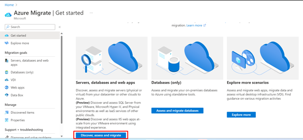
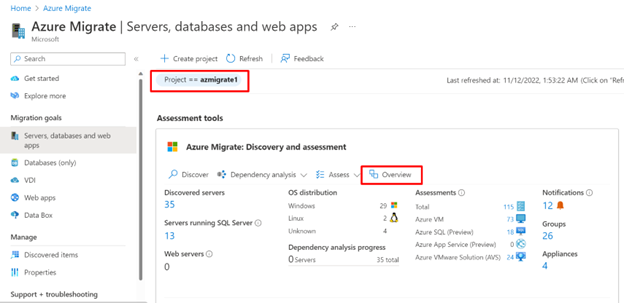
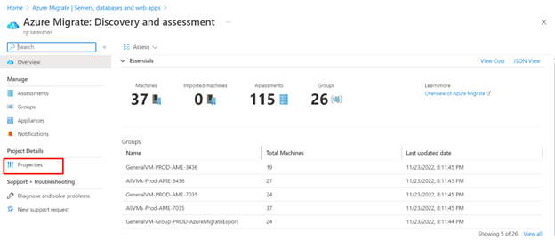

# Azure Migrate Export Utility

## What is Azure Migrate Export?
Azure Migrate Export is a utility package that uses Azure Migrate discovery and assessment information from an already deployed Azure Migrate project to generate a cohesive presentation for executives.

The utility offers users the ability to customize discovered data, assessment output as well as the visualization layer of the presentation by leveraging Microsoft’s own tools such as Excel, Power BI, and PowerPoint/PDF on Edge that would help accommodate desired customizations.

Azure Migrate Export (AME) is a centralized and scalable solution that provides a uniform estimate of cost to drive the customer’s commitment for migration to Azure. 

## How to get Azure Migrate Export Utility Package?
Users can download the Azure Migrate Export utility from https://aka.ms/azuremigrateexport.

The link downloads a .zip file. Extract the contents of the package.

The Package consists of three files:
- Azure-Migrate-Export.exe is a light-weight console app that facilitates running of discovery and assessment and helps fetch data from Azure Migrate discovery and assessment APIs.
- The PSScripts folder consists of underlying PowerShell modules.
- The PowerBI template helps build a cohesive presentation on top of discovery and assessment reports generated after running Azure-Migrate-Export.exe.
The Azure Migrate Export Utility is hosted on an open source github repository. Users can access all versions of this utility package from https://aka.ms/azuremigrateexportutility. Users can use the script to build on top of current solutions.

## How does Azure Migrate Export Work?
The discovery module of the utility package runs to pull discovered data from an already deployed Azure Migrate Project using Azure Migrate APIs. Users can then customize the discovery output for assessment. [Learn More](#how-to-customize-discovery-report) about customization on discovery file.

The assessment module of utility package uses Azure Migrate assessment APIs to run PaaS preferred assessments for in scope machines. Machines that cannot be migrated to PaaS target are assessed for IaaS targets. [Learn More](#azure-migrate-export-assessment-report-generation-logic) about AME assessment logic. The assessment module generates Assessment Core Report, Assessment Opportunity report and Clash Report. 

Users can customize the generated Assessment Core report by referring to the details in the Clash report to get rid of duplicates. This helps the user to generate presentation and cost estimates of only the required target assessments. [Learn More](#how-to-customize-assessment-core-report) about how to customize Assessment report.

The PowerBI template uses the generated discovery and assessment reports to generate the required business presentation which can be downloaded as PPT.

## Prerequisites for running Azure Migrate Export
### User Permissions 
The user logged into the machine should have the permissions and access to run EXE files. 
### Operating System 
The machine should be a 64-bit Windows machine running Windows OS 10 or later. 
### Install Location 
We recommend to download the utility in C: drive. Information is exchanged with APIs in the form of packets, and hence the install location should not have packet inspection / modification rights.
### .NET Framework Version 
The machine running Azure Migrate Export must run on .NET framework 4.7.2 or later. [Learn More](https://learn.microsoft.com/en-us/dotnet/framework/migration-guide/how-to-determine-which-versions-are-installed) on how to check the .NET version running on the machine.
### Transport Layer Security (TLS) 
The operating system must support TLS 1.2. [Learn More](https://learn.microsoft.com/en-us/windows-server/security/tls/tls-registry-settings?tabs=diffie-hellman) on how to check supported TLS version on the machine.
### Memory 
The machine running AME should have at least 8 GB of RAM. 
### Storage 
The machine running AME should have a minimum of 1 GB of free storage in the drive in which the utility package is extracted and stored. 
### Internet 
The machine needs persistent internet access, throughout the process.
### Port Access 
The machine should have TCP port 443 open with traffic direction as Outbound External and Outbound Internal, as multiple HTTPS API calls will be made to send and receive data. 
### PowerShell Version 
The machine running AME should have to have PowerShell version 5.1 or higher installed.
### Execution Policy 

> [!Note]
> The Azure Migrate Export utility configures required execution policy automatically, but we strongly recommend that users set the required execution policy before running the utility.

The execution policy in PowerShell should be set to RemoteSigned, for the CurrentUser and LocalMachine. This can be achieved by following the steps below: 
1. Open PowerShell as an administrator. 
2. Run the following commands: 
   - Set-ExecutionPolicy -Scope CurrentUser RemoteSigned 
   - Set-ExecutionPolicy -Scope LocalMachine RemoteSigned 
3. To view the Execution Policies, run the Get-ExecutionPolicy -List command.

   
  
### PowerShell Modules 
> [!Note] 
> The Azure Migrate Export utility installs modules if they are not present, but we strongly recommend having the modules pre-installed. 
> If you are installing these modules for the first time, respond [Y] for yes and [A] for ‘Yes to All” to install the required modules. 

The following modules are needed to run Azure Migrate Export.
- Nuget Provider
- PSGallery
- PowerShellGet - Command: Install-Module -Name PowerShellGet -Scope CurrentUser -Force -AllowClobber 
- Azure PowerShell - Command: Install-Module -Name Az -Scope CurrentUser -Force -AllowClobber 
- Import Excel -  Command: Install-Module -Name ImportExcel -Scope CurrentUser -Force -AllowClobber 

## Azure Migrate Export Assessment Report Generation Logic
The assessment logic for each type of workload is as below:
### SQL Assessment
SQL assessment is a three-step process:
  1. All the in-scope SQL instances are first assessed for Azure SQL Managed Instances. Details of SQL Server Instances that are ready for Azure SQL MI can be found in “SQL_MI_PaaS” tab in Assessment Core Report.
  2. The remaining SQL Instances that cannot be migrated to Azure SQL MI due to migration blockers (details of which are available in opportunity report) are then assessed for migration to SQL server in Azure VM (sizing the instance for Azure VM, using the recommended migration approach). Details of such SQL Server instances can be found in “SQL_IaaS_Instance_Rehost_Perf” tab in Assessment Core Report.
  Only Premium disks are recommended for Azure VMs that run SQL Instances on them.
  3. The remaining servers whose SQL instances are not ready for the above two migration/ modernization approaches are then assessed for readiness for SQL Server on Azure VM – using a Lift and Shift approach ie migrating an entire server not just individual SQL Server Instances running in them. Details of such SQL Server can be found in “SQL_IaaS_Server_Rehost_Perf” tab in Assessment Core report. [Learn more](https://learn.microsoft.com/en-us/azure/migrate/concepts-azure-sql-assessment-calculation) about the SQL Server assessment logic.
### Web app Assessment
Web app assessment is a two-step process:
  1. All the in-scope discovered .NET Web apps running on IIS Web Servers on Windows Server are first assessed for migration to Azure App Service. Details of the Web app that are ready for Azure App service can be found in “WebApp_PaaS” tab in Assessment Core Report.
  2. The remaining servers whose web app/web apps cannot be migrated to Azure App Service due to migration blockers (details of which are available in opportunity report) are then assessed for Azure VM. Details of such server can be found in “WebApp_IaaS_Server_Rehost_Perf” tab in Assessment Core Report. [Learn more](https://learn.microsoft.com/en-us/azure/migrate/concepts-azure-webapps-assessment-calculation) about the App Service assessment logic.
### Assessment of Servers containing SQL Services
All in-scope discovered machines  containing SQL Services such as SQL Server Integration services, SQL Server Reporting Services and SQL Server Analysis Services are assessed for migration to Azure VM – using a Lift and Shift approach. Details of such machines can be found in “VM_SS_IaaS_Server_Rehost_Perf” tab in Assessment Core Report.
### VM Assessment
The in-scope discovered Windows and Linux servers that do not have SQL Server, Web app, or SQL Services present on them are assessed for migration to Azure VM. Details of such machines can be found in “VM_IaaS_Server_Rehost_Perf” tab in Assessment Core Report. [Learn more](https://learn.microsoft.com/en-us/azure/migrate/concepts-assessment-calculation) about the Azure VM assessment logic.
### AVS Assessment
The in-scope discovered machines that are running on VMware are assessed AVS assessment. AVS is an alternate approach to PaaS preferred migration where customer can choose to rehost their VMware environment on Azure VMware Services. Details of such machines can be found in “AVS_Summary” and “AVS_IaaS_Rehost_Perf” tab in Assessment Opportunity Core Report. [Learn more](https://learn.microsoft.com/en-us/azure/migrate/concepts-azure-vmware-solution-assessment-calculation) about the AVS assessment logic.
### Azure Site Recovery and Backup
Azure Site Recovery and backup cost is only computed for the following workloads:
  - Machines and Instances running in Prod environment. 
  - Machines and Instances recommended for Migration to Azure VM.

## How to find Project, discovery, and assessment parameters
The below project identifier and discovery and assessment parameters need to input into Azure Migrate Export Console. You can find these values from the Azure portal as below:

### Tenant ID
1. Sign in to Azure.
2. Click on your profile on the top right of the page and select **Switch directory**.
3. The Portal Settings| Directories + subscriptions open to show Directory ID of your tenant which is also your Tenant ID.  

   

### Subscription ID, Resource Group Name, Discovery Site Name and Assessment Project name:
> [!Note]
> - Project Name is different from Assessment Project name.
> - Assessment Project needs to be entered for running assessments.

To find other parameters required for running discovery and assessment, follow the below steps:
1. Open Azure Migrate in Azure.
2. Select **Discovery, assess and migrate**. 

   

3. Choose the required project and select **Overview**.

   

4. Select **Properties** after clicking **Overview**.

   

5. The **Azure Migrate: Discovery and assessment | Properties** screen displayes the required Project identifier and discovery and assessment project parameters such as Subscription ID, resource group name, discovery Site name, and Assessment project name as below:

    

