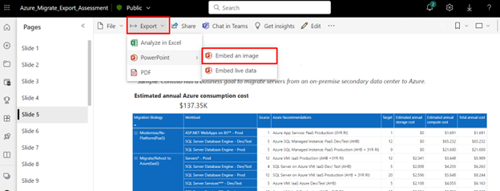

## How to run Azure Migrate Export
### Before you begin: 
- Review the pre-requisites for running Azure Migrate Export.
- Before running Azure Migrate Export, users must have successfully set up an Azure Migrate Project, deployed an Azure Migrate appliance and should have successfully discovered using Azure Migrate discovery and assessment tool.
- There are two workflows in which users can run Azure Migrate Export Utility.
   - Run without Customization or Single Click Experience - Aims to quickly generate required output with certain assumptions such as all Machines discovered are in-scope and belong to Production environment.
   - Run with Customization - Aims to allow for customization, such as classification of environment such as dev/prod to take advantage of Dev/Test pricing, moving machines out of scope for an assessment or moving machines out of scope of migration and even the visualization. [Learn More](#how-to-customize-discovery-report) on how to customize Discovery file.

### Run Azure Migrate Export without customization
Azure Migrate Export without customization quickly generates required output with certain assumptions such as all Machines discovered are in-scope and belong to Production environment. 
Follow the below steps:
1. Download the Azure Migrate Export utility package and extract the contents on the package. [Learn More](#how-to-get-azure-migrate-export-utility-package) about how to get Azure Migrate Export Utility Package.
2. Run Azure Migrate Export application.
3. To generate the Discovery and assessment reports with customization, select **Workflow Option** as Both.
4. In **Source Appliance**, select the source of servers. By default, all three sources, namely VMware, Hyper-V, and Physical are selected.
5. Enter the project identifier details such as Tenant ID, Subscription ID, Resource Group name, Discovery Site name and assessment project name. [Learn More](#how-to-find-project-discovery-and-assessment-parameters) on where to find the Project Identifier.
6. Select the **Target location** where you want to modernize your resources, the **Assessment duration** for which you want to run assessment, and select **Submit**.
7. Users will now be prompted to authenticate Azure access.
8. Once the user is authenticated in Azure, the discovery and assessment modules both run in sequence to generate discovery Report, Assessment Core Report, Assessment Opportunity Report and Assessment Clash Report. [Learn More](#discovery-and-assessment-report-analysis) about highlights of the report.
   > [!Note] 
   > Assessment typically runs in 1-2 hours but may take more time to run depending on the size of environment.
9. Users can choose to customize assessment report for removing required duplicates in assessment. [Learn More](#how-to-customize-assessment-core-report) about how to customize assessment reports.
10. Run the “Azure_Migrate_Export.pbit” PowerBI template provided in the Utility package.
11. Provide the path of utility package where all the reports are generated and click Load. [Learn More](#how-to--find-basepath) about base Path.
12. Once the data is loaded, Users can now choose to change static data in PowerBI report to customize as per requirement. [Learn More](#how-to-customize-powerbi-report) about how to customize PowerBI Report.
13. After finalizing the slides, publish the PowerBI report on your workspace.
   
14. You can download the Azure Migrate Export Executive Presentation as PPT from your workspace.
   

## Run following commands on PowerShell to test proper installation 
Run the following commands in the order specified, these are the commands run by the scripts to connect to Azure Portal API and can help verify proper installation of Az PowerShell module. 
1.	Command –> Get-Module -ListAvailable -Name ‘Az.*’ : This command should list all the PowerShell modules that should be installed as a part of Az PowerShell module and the directory they can be found in at the top. 
2.	Command –> Connect-AzAccount -Tenant <your_tenant_id> : This command should prompt the user to login with their Microsoft account. 
3.	Command –> Set-AzContext -Subscription <your_subscription_id> : When run successfully, it should display the SubscriptionName, Account and TenantId 
4.	Command –> Get-AzAccessToken -ResourceUrl ‘https://management.azure.com/’ : When run successfully, it should display the Token, ExpiresOn, Type, TenantId and UserId 
 
